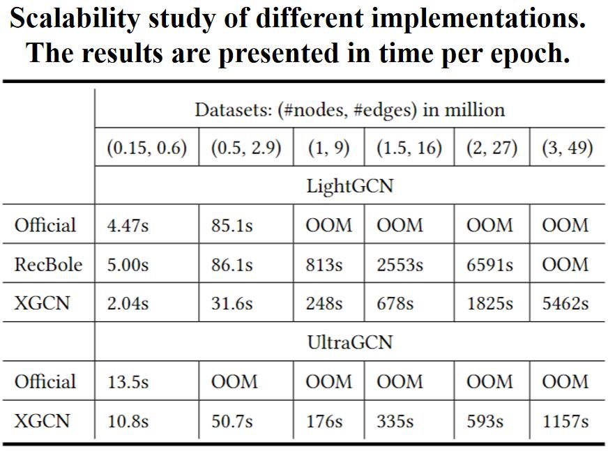
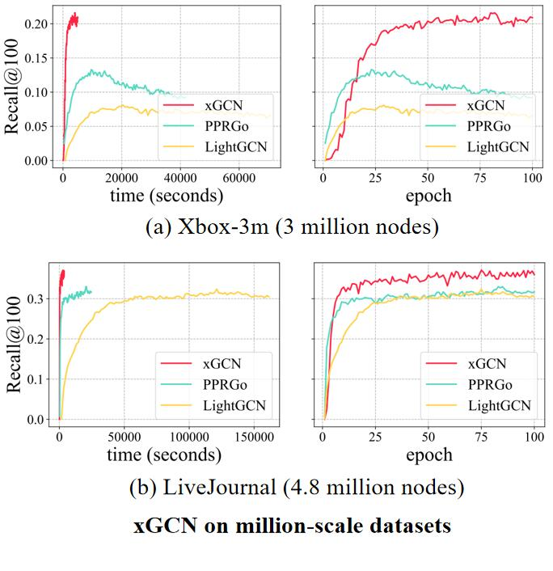
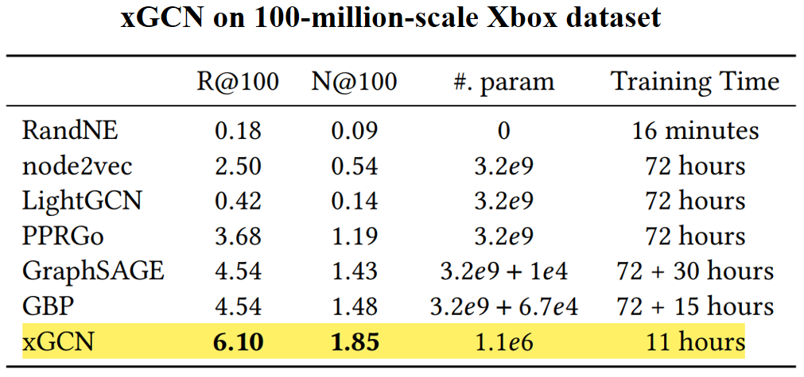

.. XGCN documentation master file, created by
   sphinx-quickstart on Tue Feb 14 09:22:13 2023.
   You can adapt this file completely to your liking, but it should at least
   contain the root `toctree` directive.
.. title:: XGCN v0.0.0

Welcome to XGCN!
===================================

XGCN is a light-weight and easy-to-use library for large-scale Graph Neural Network (GNN) embedding, 
aiming at helping researchers to quickly embed million-scale graphs in a single-machine environment. 
XGCN includes **xGCN** - an implementation for the TheWebConf 2023 paper: 
**xGCN: An Extreme Graph Convolutional Network for Large-scale Social Link Prediction**. 

Full documentation: https\://xgcn.readthedocs.io/en/latest/index.html

We now focus on embedding models for **social link prediction** (also knows as friend recommendation) 
and **user-item link prediction** (i.e. the classic recommendation task), 
where each node in the graph is assigned a learnable ID embedding. Other tasks like node classification 
can also be easily added into our framework. 

**Features**:

- Large-scale GNN embedding
   XGCN targets at constructing GNN embedding models that can easily run on million-scale graphs 
   in a single-machine environment. 
   Many official GNN implementations (e.g. LightGCN, UltraGCN) mainly consider small datasets and have 
   difficulties on processing large graphs. 
   In XGCN, by fully utilizing DGL and PyTorch's mechanism, we not only 
   reproduce a series of GNNs that have better scalability, but also provide a platform to create and train 
   your own large-scale models. 
   
   We evaluate several open-source implementations by generating graphs of different scales 
   (from 0.15 million nodes to 3 million nodes) and recording the training speed under the same hyper-parameters. 
   The server's CPU is Intel(R) Xeon(R) CPU E5-2680 v4 @ 2.40GHz with 252GB memory. The GPU is Tesla P100-PCIE-16GB 
   with 16GB memory. The tested RecBole version is v1.1.1. 
   The LightGCN's code is from https\://github.com/gusye1234/LightGCN-PyTorch.git (branch: master, commit SHA\: 947ca2b). 
   The UltraGCN's code is from https\://github.com/xue-pai/UltraGCN.git (branch: main, commit SHA\: c460a05). 
   (Note that currently RecBole v1.1.1 does not provide UltraGCN implementation.)

   The results are shown in the figures below. We observe that XGCN have much better scalability on million-scale graphs. 
   

- xGCN - a brand new GNN embedding model
   XGCN includes xGCN - an implementation for the TheWebConf 2023 paper: 
   **xGCN: An Extreme Graph Convolutional Network for Large-scale Social Link Prediction** - 
   which achieves remarkable accuracy and efficiency on large graphs, 
   including an industrial dataset with 100 million nodes. Some results are as follows:

- A complete data pipeline for large graphs
   XGCN covers a complete machine learning pipeline: from raw dataset processing to model training and evaluation. 
   We provide APIs to efficiently process large graphs. 

- Easy-to-use infrastructure
   XGCN is friendly to those who want to create new models. 
   We provide clear interface for each module. One can easily develop a new model 
   by inheriting a base class such as ``BaseEmbeddingModel``. 

Install
------------------

We recommend to install XGCN from source with the following command:
(Python \>= 3.8, torch \>= 1.7.0, dgl \>= 0.9, torch_geometric \>= 2.0 are required.)

.. code:: bash

    git clone git@github.com:xiransong/XGCN_library.git -b dev
    cd xGCN
    python -m pip install -e .
