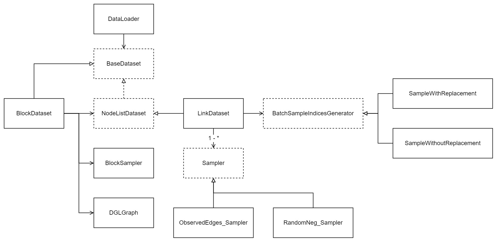

Custmize DataLoader
=========================

In this section, we'll first present an overview of the modules in DataLoader and 
then customize a new one. 

1. Overview
-----------------------------

In XGCN, the dataloader is called by ``Trainer`` during the batch training, 
and basically it only needs to be an iterable object. 
To add a new dataloader, you can simply implement it as an iterable object
on your own and add it to ``XGCN.build_DataLoader()`` 
(see ``build_DataLoader()`` in ``XGCN/dataloading/build.py``), 
or you can use the infrastructure provided by XGCN. 

In this section, we focus on introducing main components of
the XGCN dataloader infrastructure. 
The UML class diagram is shown in the figure below. 

The interface classes are defined in ``XGCN/dataloading/base.py``, they describe 
a series of interface functions. 
The ``BaseDataset`` class requires three functions: ``__len__()``, ``__getitem__()``, 
and ``on_epoch_start()``. 
Note that the ``__getitem__()`` function is supposed to return a batch of training sample 
given the batch index. 
``NodeListDataset`` further requires the returned data in ``__getitem__()`` 
should include a list of tensors of node IDs. 
The ``Sampler`` is used to generate positive/negative training samples 
given the sample index. And the ``BatchSampleIndicesGenerator`` is used to 
generate sample indices given the batch index. 

To train large-scale message-passing GNNs, mini-graph sampling is often needed. 
In XGCN, the ``BlockDataset`` class utilize the ``NodeListDataset``
and DGL's ``BlockSampler`` to conduct mini-graph sampling. 

The function ``XGCN.build_DataLoader()`` is used to initialize a dataloader. 
You can refer to the functions in ``XGCN/dataloading/build.py``. 

2. New dataloader design
-----------------------------

In the following, let's customize a new dataloader and apply it to a GNN model. 
Traditional graph-based training methods use the edges in the graph as positive training 
samples, here we use the PPR neighbors instead. 

2. Implement a Sampler
-----------------------------

3. Config and run!
-----------------------------
