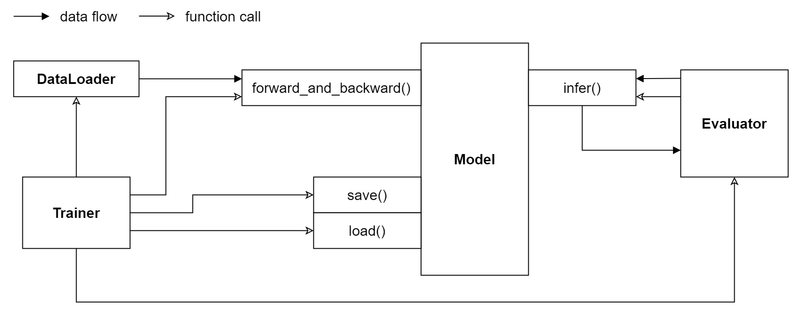

Customize Model
=========================

In this part, let's dive into the implementations of a model 
by customizing a new one. 
We'll first introduce the interface functions of a model, and then 
give some implementation examples of them. 

1. Overview
-----------------------------

As shown in the figure above, to communicate with other modules, 
plus ``__init__()``, a ``Model`` must implement five interface functions: 

(1) ``__init__()``. This function is called by ``XGCN.build_Model`` 
and is responsible for initializing model parameters and optimizers. 

(2) ``forward_and_backward()``. This function is called by ``Trainer`` 
during the batch training and is supposed to execute forward calculation and 
backward propagation. 

(3) ``eval()``. This function is called by ``Evaluator`` and is expected to return 
the corresponding prediction to calculate accuracy metrics. 

(4) ``save()``. This function is call by ``Trainer`` when a new best score on the 
validation set is achieved. The function should save the parameters that is needed 
by ``eval()``. 

(5) ``load()``. This function is call by ``Trainer`` when the training process is converged 
and the testing is to begin. The function should load the saved best parameters. 

Specifically, these functions are described by the ``BaseModel`` class (see ``XGCN/base/BaseModel.py``) 
which must be inherited by a new model. 
XGCN also provides a ``BaseEmbeddingModel`` class which is inherited from ``BaseModel`` 
and implements some useful functions for model evaluation 
(see ``XGCN/model/base/BaseEmbeddingModel.py``). 
It's easier to start from the ``BaseEmbeddingModel`` class. 
With it we only need to implement these three functions: 
``__init__()``, ``forward_and_backward()``, and ``on_eval_begin()``. 

In the following, we'll create a new model based on the ``BaseEmbeddingModel`` class, 
and implement the needed functions. 
Firstly, create a file named ``NewModel.py`` in the ``XGCN/model`` directory 
with the contents below: 

.. code:: python

    from XGCN.model.base import BaseEmbeddingModel
    from XGCN.model.module import init_emb_table, dot_product, bpr_loss
    from XGCN.utils import io

    import torch
    import os.path as osp

    class NewModel(BaseEmbeddingModel):
        
        def __init__(self, config, data):
            super().__init__(config, data)
            pass
        
        def forward_and_backward(self, batch_data):
            loss = 0.0
            return loss
        
        @torch.no_grad()
        def on_eval_begin(self):
            pass

2. Implement __init__()
-----------------------------

The ``__init__()`` function is responsible for initializing model parameters and optimizers. 
For simplicity, here we just create an embedding table, an MLP, and a Adam optimizer: 

.. code:: python

    def __init__(self, config, data):
        super().__init__(config, data)
        self.emb_table = init_emb_table(self.config, self.info['num_nodes'])
        self.mlp = torch.nn.Sequential(
            torch.nn.Linear(self.config['emb_dim'], 1024), 
            torch.nn.Tanh(), 
            torch.nn.Linear(1024, self.config['emb_dim']), 
        )
        self.opt = torch.optim.Adam([
            {'params': self.emb_table.parameters(),'lr': self.config['emb_lr']},
            {'params': self.mlp.parameters(), 'lr': self.config['dnn_lr']},
        ])

3. Implement forward_and_backward()
-----------------------------

The ``forward_and_backward()`` function receives batch training data, 
executes forward calculation, and performs backward propagation. 
Here we use the BPR loss and the L2 regularization: 

.. code:: python

    def forward_and_backward(self, batch_data):
        ((src, pos, neg), ) = batch_data

        src_emb = self.mlp(self.emb_table(src))
        pos_emb = self.mlp(self.emb_table(pos))
        neg_emb = self.mlp(self.emb_table(neg))

        pos_score = dot_product(src_emb, pos_emb)
        neg_score = dot_product(src_emb, neg_emb)

        loss = bpr_loss(pos_score, neg_score)

        rw = self.config['L2_reg_weight']
        L2_reg_loss = 1/2 * (1 / len(src)) * (
            (src_emb**2).sum() + (pos_emb**2).sum() + (neg_emb**2).sum()
        )
        loss += rw * L2_reg_loss

        opt.zero_grad()
        loss.backward()
        opt.step()

        return loss.item()

4. Implement on_eval_begin()
-----------------------------

``Trainer`` supports using ``Model`` to execute some auxiliary functions,
such as ``on_epoch_begin()``, at several key points 
of the training process (see ``XGCN\train\Trainer.py``). 

Usually, we need to implement the ``on_eval_begin()`` function in order to 
infer the whole output embedding table before the evaluation. 
``BaseEmbeddingModel`` specify a ``self.out_emb_table`` and a ``self.target_emb_table`` 
that must be inferred in ``on_eval_begin()``. The former contains the output embeddings for 
all the nodes. And the latter is the embedding table for target nodes (e.g. in user-item graphs, 
the target nodes are items). 

.. code:: python

    @torch.no_grad()
    def on_eval_begin(self):
        self.out_emb_table = torch.empty(
            size=self.emb_table.weight.shape, dtype=torch.float32
        )
        dl = torch.utils.data.DataLoader(
            dataset=torch.arange(self.info['num_nodes']), 
            batch_size=256
        )
        for nids in tqdm(dl, desc="infer output emb"):
            self.out_emb_table[nids] = self.mlp(self.emb_table(nids))
        
        if self.graph_type == 'user-item':
            self.target_emb_table = self.out_emb_table[self.info['num_users'] : ]
        else:
            self.target_emb_table = self.out_emb_table

5. Add to build_Model()
---------------------------------

Once the model is complete, it is supposed to be added into ``XGCN.build_Model()`` 
so that XGCN is able to find it: 

.. code:: python

    # XGCN/model/build.py

    from XGCN.model.xGCN import xGCN
    ...
    from XGCN.model.NewModel import NewModel

    def build_Model(config, data):
        if config['model'] == 'Node2vec':
            from XGCN.model.Node2vec import Node2vec
            model = Node2vec(config, data)
        else:
            model = {
                'NewModel': NewModel,  # <-- add your NewModel here
                'xGCN': xGCN,
                ...
            }[config['model']](config, data)
        return model

5. Config and Run!
-----------------------------

Now we are ready to run the model, but before that, let's first 
make a template configuration file to make the configuration arguments clear 
for others. For example, add a file - ``NewModel-config.yaml`` - in ``XGCN/config`` 
with the following contents: 

.. code:: yaml

    # in XGCN/config/NewModel-config.yaml

    # Dataset/Results root
    data_root: ""
    results_root: ""
    
    # Trainer configuration
    epochs: 200
    val_freq: 1
    key_score_metric: r100
    convergence_threshold: 20
    
    # DataLoader configuration
    Dataset_type: NodeListDataset
    num_workers: 1
    NodeListDataset_type: LinkDataset
    pos_sampler: ObservedEdges_Sampler
    neg_sampler: RandomNeg_Sampler
    num_neg: 1
    BatchSampleIndicesGenerator_type: SampleIndicesWithReplacement
    train_batch_size: 2048
    epoch_sample_ratio: 0.1
    
    # Evaluator configuration
    val_method: "MultiPosWholeGraph_Evaluator"
    val_batch_size: 256
    file_val_set: ""
    test_method: "MultiPosWholeGraph_Evaluator"
    test_batch_size: 256
    file_test_set: ""

    # Model configuration
    seed: 1999
    model: NewModel
    from_pretrained: 0
    file_pretrained_emb: ""
    freeze_emb: 0
    use_sparse: 0
    emb_dim: 64 
    emb_init_std: 0.1
    emb_lr: 0.01
    loss_type: bpr
    L2_reg_weight: 0.0

With the ``.yaml`` file, we can run the new model with the following script:

.. code:: bash

    # write your own paths here:
    all_data_root='/.../XGCN_data'
    config_file='../config/NewModel-config.yaml'
    
    python -m XGCN.main.run_model \
        --config_file $config_file \
        --data_root $all_data_root/dataset/instance_facebook \
        --results_root $all_data_root/model_output/NewModel \
        --file_val_set $all_data_root/dataset/val_set.pkl \
        --file_test_set $all_data_root/dataset/test_set.pkl \
