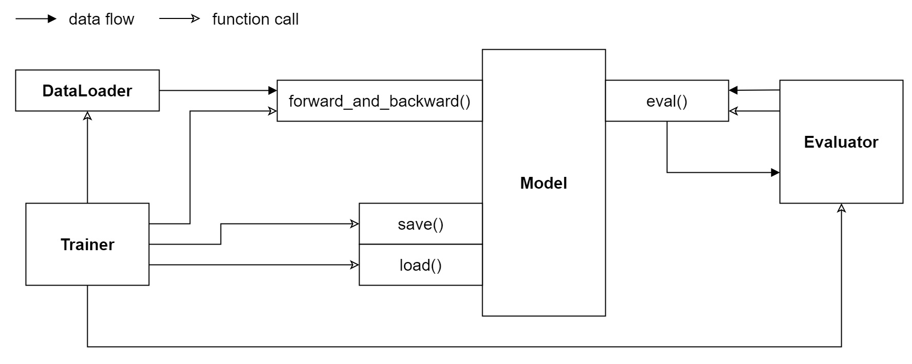

Customize Models
=========================

In this part, let's go through how to customize a new model, starting from the 
``BaseEmbeddingModel`` class provided by XGCN. 

1. Interface Overview
-----------------------------

As shown in the figure below, to utilize other modules like ``Trainer``, 
a ``Model`` must implement some interface functions. 

Specifically, these interface functions are described by the ``BaseModel`` class 
which must be inherited by a new model. 
The ``BaseModel`` class and the descriptions of each function is as follows: 

.. code:: python

    class BaseModel:
        
        def __init__(self, config, data):
            # init model parameters
            # init optimizer
            pass
        
        def forward_and_backward(self, batch_data):
            # This function is called by Trainer during the training loop. 
            # Given a batch of training data,
            # perform forward process to calculate loss, 
            # and then perform backward process to update model parameters.
            # The form of batch_data depends on the configuration of DataLoader. 

            # Return loss value.
            loss = 0.0
            return loss
        
        def eval(self, batch_data):
            # This function will be called by the Evaluator.
            # The form of batch_data depends on the configuration of Evaluator, 
            # and the return value should also correspond to the Evaluator.
            output = None
            return output
        
        def save(self, root=None):
            # This function is called by Trainer to save the best model parameters during training. 
            pass
        
        def load(self, root=None):
            # After the training process converges, this function is called by Trainer 
            # to load the saved best model for testing.
            pass

2. Implement __init__()
-----------------------------

XGCN provides a ``BaseEmbeddingModel`` class which is inherited from ``BaseModel`` 
and implements some useful functions for model evaluation. 
With the ``BaseEmbeddingModel`` class, we only need to implement two interface functions: 
``forward_and_backward()`` 
Let's start from it and create a new model. 

.. code:: python

    class NewModel(BaseEmbeddingModel):
        
        def __init__(self, config, data):
            super().__init__(config, data)
            pass
        
        def forward_and_backward(self, batch_data):
            loss = 0.0
            return loss
        
        @torch.no_grad()
        def on_eval_begin(self):
            pass

3. Implement forward_and_backward()
-----------------------------

4. Implement on_eval_begin()
-----------------------------

5. Add model to build_Model()
-----------------------------
