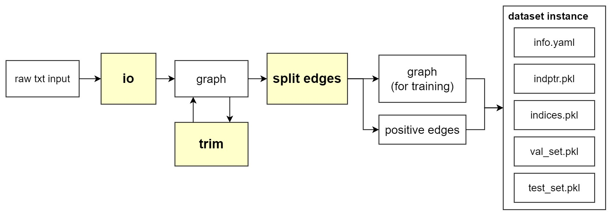

Data Process API
===================

XGCN has three data processing module: 
``XGCN.data.io``, ``XGCN.data.trim``, and ``XGCN.data.split_edges``. 
The overall data processing pipeline is as follows: 

XGCN.data.io
-----------------

This module is responsible for handling disk-reading/writing operations. 
For example, suppose we have a text file containing adjacency table of the graph: 

.. code:: 

    0 1 2
    1 4
    2 1 3 4
    ...

where each line contains a source node and some neighbor nodes. 
If the node IDs are already continuous integers, 
we can use the ``XGCN.data.io.load_txt_adj_as_edges`` function to load the graph:

.. code:: python

    >>> E_src, E_dst = load_txt_adj_as_edges('graph.txt')
    >>> print(E_src)
    [0, 0, 1, 2, 2, 2, ...]
    >>> print(E_dst)
    [1, 2, 4, 1, 3, 4, ...]

In other cases, the raw IDs are just string tokens. Suppose we have an file of edge list 
where each line presents a user-item interaction: 

.. code:: 

    AH2L9G3DQHHAJ 0000000116
    A2IIIDRK3PRRZY 0000000116
    A1TADCM7YWPQ8M 0000000868
    ...

We can use the ``XGCN.data.io.load_and_reindex_user_item_graph`` function to load it 
and re-index each ID into continuous integer: 

.. code:: python

    >>> E_src, E_dst, user_id_mapping, item_id_mapping = load_and_reindex_user_item_graph('graph.txt')

The ``user_id_mapping`` and ``item_id_mapping`` are ``ReIndexDict``s containing the ID mapping 
(please refer to ``XGCN/utils/ReIndexDict.py``). 

For more information of the ``XGCN.data.io`` module, please refer to the data processing examples 
in the following section and the code in ``XGCN/data/io``. 

XGCN.data.trim
------------------

Some industrial graph datasets tend to be large-scale 
(e.g. Taobao's transaction record), and we might want to get a smaller one for model 
development and quick evaluation. This module has two functions, 
helping users trim graphs by dropping nodes randomly or according to nodes' degrees: 

* ``XGCN.data.trim.drop_nodes_randomly(g: dgl.DGLGraph, num_drop, node_mask=None)``

* ``XGCN.data.trim.drop_nodes_by_degree(g: dgl.DGLGraph, node_mask=None, 
min_out_degree=None, max_out_degree=None, min_in_degree=None, max_in_degree=None)``

XGCN.data.split_edges
-------------------------

To evaluate a link prediction model, it is common to 
split a portion of edges as positive samples. The source node and destination node of a 
removed edge should satisfiy some requirements about degrees, e.g., suppose we don't 
expect a node's out-degree becoming zero after the split. 
This can be achieved using the function:

* ``XGCN.data.split_edges.split_edges(g, num_sample, min_src_out_degree, min_dst_in_degree)``
