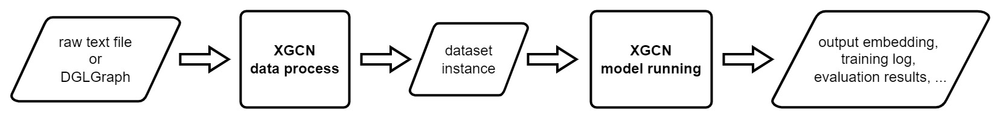

Overview
================

The "User Guide" section is for those who want to quickly get started 
and run models. An overview of the running pipeline is shown in the figure below: 

XGCN supports process text files of the graph and evaluation sets as input,
and processes them into a standard **"dataset instance"** format 
which is used by all the downstream models. 
Once a dataset instance is generated, you can easily run models with XGCN's 
command line interface or API functions. 

In the following, we'll introduce how to use XGCN from the four aspects below:

* **Data Preparation**: how to process your text data into our "dataset instances". 

* **Training and Evaluation**: the model training and evaluation APIs. 

* **Supported Models**: currently available models and their configurations. 

* **Usage Examples**: end-to-end usage examples. 
